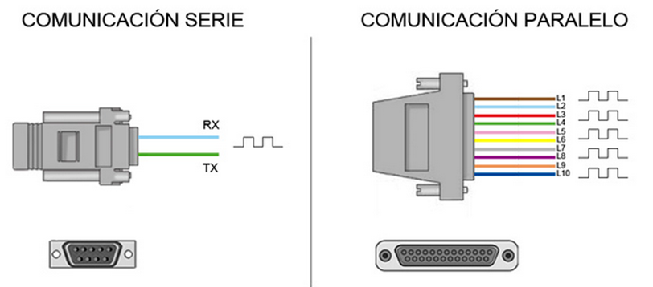
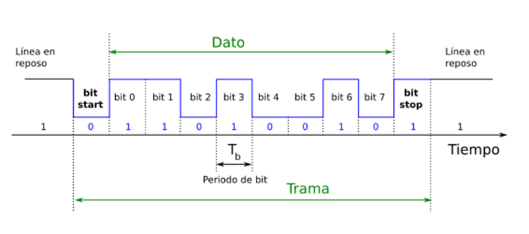
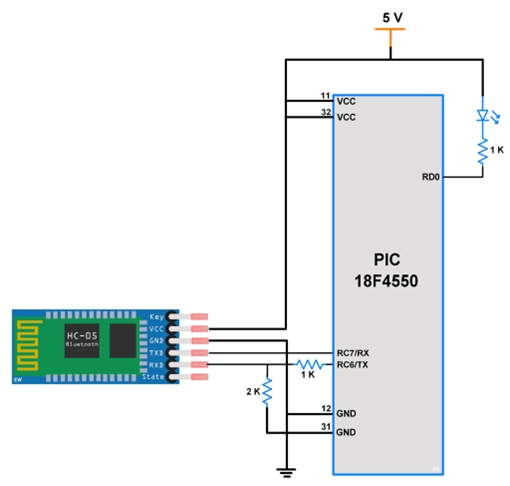
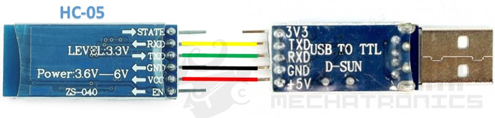
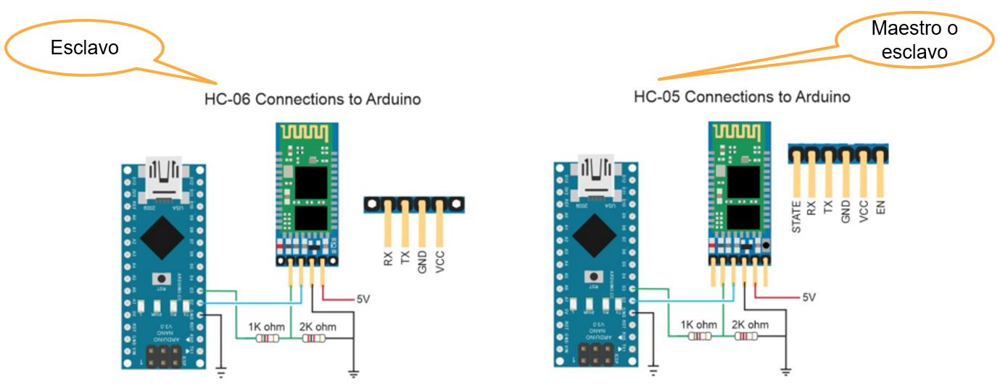
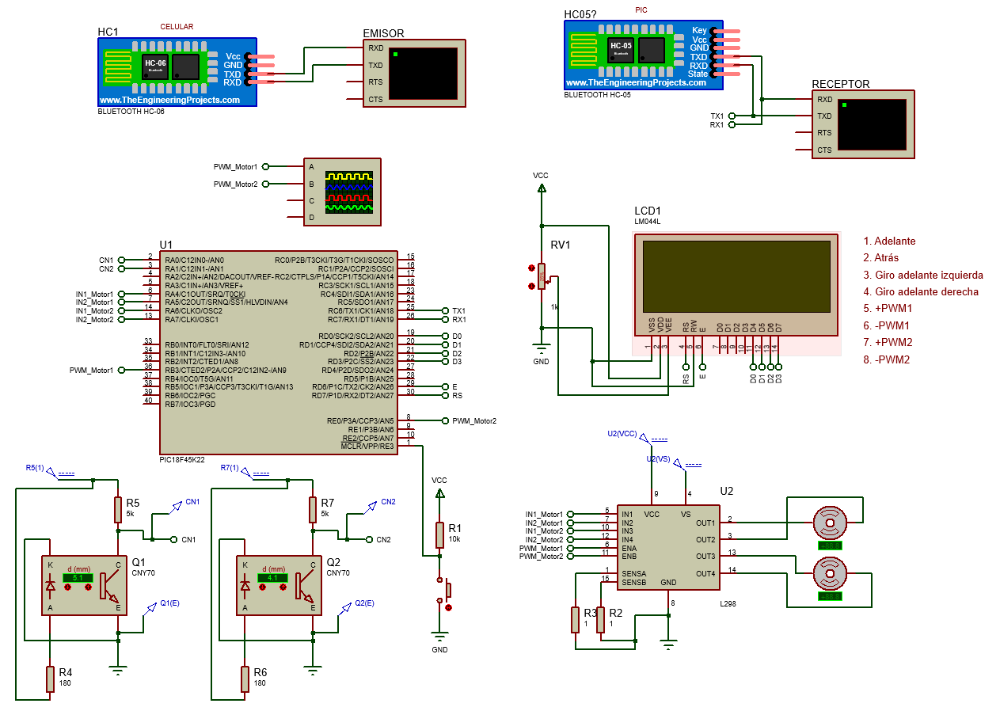

<h1>Aula 12</h1>

Esta clase consiste en comprender la omunicación serial UART con Bluetooth (HC-05 y HC-06)

<h2>Comunicación serial UART</h2>

La comunicación serial (simplex, half o full duplex) permite transmitir y/o recibir datos bit a bit, punto a punto (microcontroladores, PC, sistema embebido) de forma asíncrona (UART) o síncrona (USART). 

Fuente: http://tutosrafaz.blogspot.com/2015/06/comunicacion-serial-rs232-pic16f887a.html

<h3>Trama serial de datos</h3>

RS232 y RS485 son dos comunicaciones seriales de tipo asíncrona (UART), las cuales tienen el estándar de transmisión serie que define la trama más conocida como 8N1 (8 bits de datos, Ninguno de paridad y 1 bit de stop).

Fuente: https://github.com/Obijuan/open-fpga-verilog-tutorial/wiki/Cap%C3%ADtulo-21:-Baudios-y-transmisi%C3%B3n

$$𝑇_𝑏 = 1/𝑉𝑡$$

$$𝑇_𝑏 = 1/9600 (𝑏𝑖𝑡𝑠/𝑠)$$

$$𝑇_𝑏 = 104.167 𝜇𝑠$$

<h3>PIC - PC</h3>

Fuente: https://deepbluembedded.com/usb-ttl-converter-tutorial-pc-control-for-microcontrollers/

<b>*+5V del PIC puede conectarse a una fuente externa o a los +5V del FTDI</b>

<h3>HC-05 - PIC</h3>

Fuente: https://deepbluembedded.com/usb-ttl-converter-tutorial-pc-control-for-microcontrollers/

<h3>HC-05 - PC</h3>

Fuente: https://naylampmechatronics.com/blog/24_configuracion-del-modulo-bluetooth-hc-05-usando-comandos-at.html

<h3>HC-05 - Arduino</h3>

<h3>HC-05</h3>

A través de comandos AT es posible configurar el modo de funcionamiento (esclavo), el nombre (HC-05), la clave del módulo (1234) y la velocidad de baudios (9600). Este módulo tiene cuatro modos:

1. Estado Desconectado:
- Entra a este estado tan pronto alimentas el modulo, y cuando no se ha establecido una conexión bluetooth con ningún otro dispositivo
- EL LED del módulo en este estado parpadea rápidamente
- En este estado a diferencia del HC-06, el HC-05 no puede interpretar los comandos AT (configuración)

2. Estado Conectado o de comunicación
- Entra a este estado cuando se establece una conexión con otro dispositivo bluetooth.
- El LED hace un doble parpadeo.
- Todos los datos que se ingresen al HC-05 por el Pin RX se trasmiten por bluetooth al dispositivo conectado, y los datos recibidos de la comunicación bluetooth se devuelven por el pin TX.

3. Modo AT 1 (modo de programación 1)
- Para entrar a este estado después de conectar y alimentar el modulo es necesario presionar el botón del HC-05.
- En este estado, podemos enviar comandos AT, pero a la misma velocidad (baudios) con el que está configurado.
- El LED del módulo en este estado parpadea rápidamente igual que en el estado desconectado.

4. Modo AT 2 (modo de programación 2)
- Para entrar a este estado es necesario tener presionado el botón al momento de alimentar el modulo, es decir el modulo debe encender con el botón presionado, después de haber encendido se puede soltar y permanecerá en este estado.
- En este estado, para enviar comandos AT es necesario hacerlo a la velocidad de 38400 baudios, esto es muy útil cuando nos olvidamos la velocidad con la que hemos dejado configurado nuestro modulo.
- El LED del módulo en este estado parpadea lentamente.

<h3>HC-05 (Modo AT 1)</h3>

Los comandos AT pueden ser enviados a través de un monitor serial

1. Test de comunicación:  
Enviar: AT  
Respuesta: OK 

2. Configurar el nombre del módulo HC-05:  
Enviar: AT+NAME=<Nombre> (ej: AT+NAME=Bob)  
Respuesta: OK

3. Configurar clave:  
Enviar: AT+PSWD=<"Pin">   (ej: AT+PSWD="2560”) 
Respuesta: OK

4. Configurar la velocidad de comunicación: 
Enviar: AT+UART=<Baud> ,< StopBit>,< Parity> (ej: AT+UART=9600,0,0) 
Respuesta: OK

5. Configurar el modo (maestro(1) o esclavo(0)):  
Enviar: AT+ROLE=<Role> (ej: AT+ROLE=0) 
Respuesta: OK

<h3>Ejercicio 1</h3>

