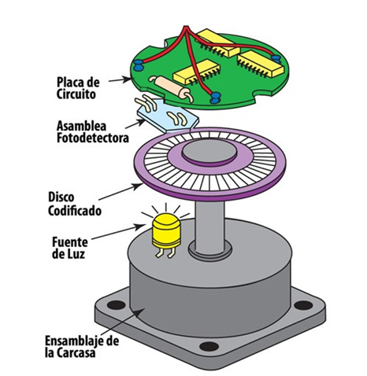
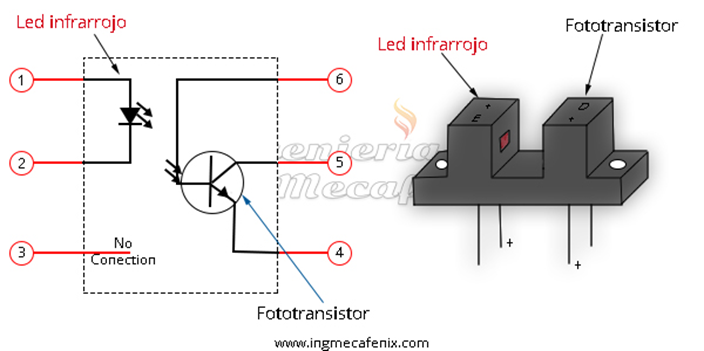
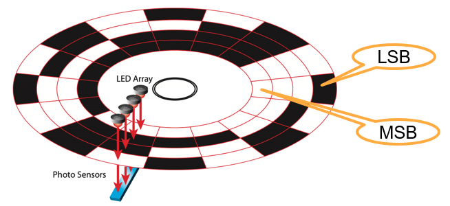
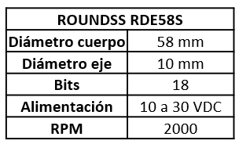
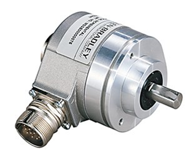
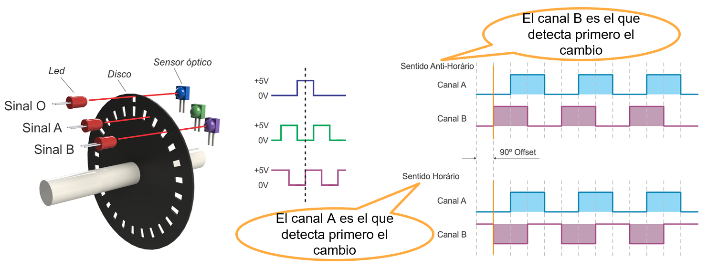
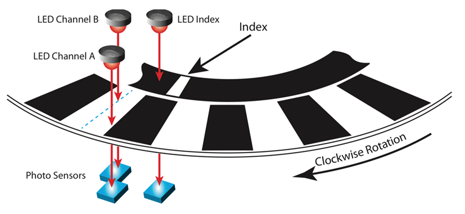

<h1>Aula 13</h1>

Esta clase consiste en comprender 

<h2>Encoder</h2>

Es un dispositivo que permite medir una posición o velocidad lineal (encoder lineales) o angular (encoder rotativos) a través de información digital a partir de un movimiento. Son desarrollados mediante tecnología óptica, mecánica o magnética.

Fuente: https://como-funciona.co/un-encoder/

<h3>Optoacoplador</h3>

Fuente: https://www.ingmecafenix.com/electronica/optoacoplador/

<h3>Encoder absoluto</h3>

El encoder absoluto permite conocer la posición y la velocidad angular del eje mediante la decodificación de un conjunto de bits

$$𝑅𝑒𝑠𝑜𝑙𝑢𝑐𝑖ó𝑛=\frac{360°}{2^𝑛}$$

$$Á𝑛𝑔𝑢𝑙𝑜=\frac{𝑑𝑒𝑐𝑖𝑚𝑎𝑙/dot360°}{2^𝑛}$$

<h3>Encoder incremental</h3>

El encoder incremental o relativo permite conocer la posición angular y la variación de desplazamiento angular (velocidad angular), mediante el conteo de pulsos por vuelta. El desfase entre las señales permite determinar la dirección de la rotación

Fuente: https://tecmaf.com.br/o-que-e-encoder-e-qual-sua-funcao/

Fuente: https://www.packworld.com/home/article/21134849/encoder-selection-tips

$$𝑅𝑒𝑠𝑜𝑙𝑢𝑐𝑖ó𝑛=\frac{360°}{𝑝𝑝𝑟}$$

$$Á𝑛𝑔𝑢𝑙𝑜=\frac{𝑝𝑢𝑙𝑠𝑜𝑠\cdot360°}{𝑝𝑝𝑟}$$

$$𝜔=\frac{\frac{1}{𝑇}\cdot60}{𝑝𝑝𝑟}$$

