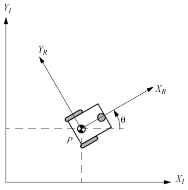

<h1>Aula 14</h1>

Esta clase consiste en aplicar la cinemática directa e inversa de la plataforma diferencial analizando recorridos por trayectorias.

<h2>Análisis de recorrido por trayectorias</h2>

El análisis de recorrido por trayectorias consiste en analizar una trayectoria circular de la plataforma robótica, linealizando dicha trayectoria a través de puntos intermedios equidistantes en tiempo, para determinar la posición y la orientación de la misma.

Fuente: Introduction to Autonomous Mobile Robots. Roland Siegwart and Illah R. Nourbakhsh. 2004

$𝑉_𝑃≠0$ y $𝜔_𝑃≠0$ 

$𝑉_𝑃=\frac{𝑟_𝑟(𝜔_𝐷+𝜔_𝐼)}{2}$ y $𝜔_𝑃=\frac{𝑟_𝑟(𝜔_𝐷−𝜔_𝐼)}{𝐿}$

$𝜔_𝐼=−\frac{𝐿𝜔_𝑃}{2𝑟_𝑟}+\frac{𝑉_𝑃}{𝑟_𝑟}$ y $𝜔_𝐷=\frac{𝐿𝜔_𝑃}{2𝑟_𝑟}+\frac{𝑉_𝑃}{𝑟_𝑟}$

$$𝑉_𝑃=\frac{∆𝑑}{∆𝑡}=\frac{𝑑_1−𝑑_0}{∆𝑡}$$

$$𝑑_1=𝑑_0+𝑉_𝑃 \cdot ∆𝑡$$

$$𝑋_𝑘=𝑋_{𝑘−1}+𝑉_{𝑃𝑋_{𝑘−1}} \cdot ∆𝑡$$

$$𝑌_𝑘=𝑌_{𝑘−1}+𝑉_{𝑃𝑌_{𝑘−1}} \cdot ∆𝑡$$

$$𝜃_𝑘=𝜃_{𝑘−1}+𝜔_𝑃 \cdot ∆𝑡$$

$$𝑉_{𝑃𝑋_𝑘}=𝑉_𝑃 \cdot cos⁡𝜃_𝑘$$

$$𝑉_{𝑃𝑌_𝑘}=𝑉_𝑃 \cdot sin𝜃_𝑘$$

<h3>Ejercicio 1</h3>

Trayectoria 1: Un robot móvil diferencial de ancho de 15 𝑐𝑚 se desplaza a 30° con respecto al eje X durante 4𝑠 y gira en las ruedas (𝑟=3𝑐𝑚) derecha a 35 𝑅𝑃𝑀 e izquierda a 25 𝑅𝑃𝑀. Así mismo, las posiciones iniciales de la plataforma en X y Y son de 3 𝑚 y 2 𝑚, respectivamente. Tener en cuenta un tiempo de muestreo de 1s. Sin aceleración lineal y angular, determinar:

<ol type="a">
    <li>La posición final en X</li>
    <li>La posición final en Y</li>
    <li>El ángulo final de la plataforma</li>
</ol>

<h3>Ejercicio 2</h3>

Trayectoria 2: A partir del recorrido 1 (ejercicio 1) un robot móvil diferencial gira en las ruedas derecha a 25 𝑅𝑃𝑀 e izquierda a 35 𝑅𝑃𝑀, respectivamente; durante 4𝑠. Tener en cuenta un tiempo de muestreo de 0.25s. Sin aceleración lineal y angular, determinar:

<ol type="a">
    <li>La posición final en X</li>
    <li>La posición final en Y</li>
    <li>El ángulo final de la plataforma</li>
</ol>