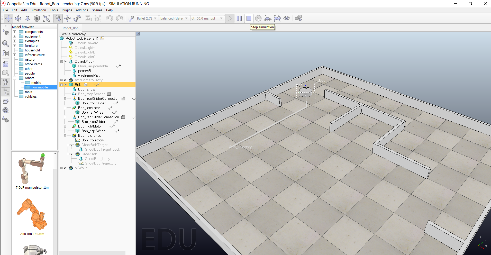

<h1>Aula 15</h1>

Esta clase consiste en simular en COPPELIA SIM el comportamiento de la plataforma diferencial, teniendo en cuenta sus cinemáticas directa e inversa.

<h2>COPPELIA SIM</h2>

COPPELIA SIM es un simulador de robótica que permite tener en cuenta las físicas de los objetos.

https://coppeliarobotics.com

<h3>Ejemplo 1</h3>



El código de este ejemplo está corriendo en la versión 4.2.0 (64 bits), sin embargo, en las versiones más actuales de COPPELIA SIM no existen las mismas funciones

```lua
function sysCall_init()
    corout=coroutine.create(coroutineMain)
end

function sysCall_actuation()
    if coroutine.status(corout)~='dead' then
        local ok,errorMsg=coroutine.resume(corout)
        if errorMsg then
            error(debug.traceback(corout,errorMsg),2)
        end
    end
end

function coroutineMain()
    -- Put some initialization code here
    r=0.05;.
    L=0.25;
    Robot = sim.getObjectHandle('Bob') 
    MI = sim.getObjectHandle('Bob_leftMotor')
    MD = sim.getObjectHandle('Bob_rightMotor')
    --Transicion 1
    Vp = 0.1;
    Wp = 0;
    VW = VelocityWheels(Vp,Wp,r,L)
    sim.setJointTargetVelocity(MI,VW[2])--1 rad/s
    sim.setJointTargetVelocity(MD,VW[1])--1 rad/s
    sim.wait(20)
    --Transicion 2
    Vp = 0;
    Wp = (math.pi/4)/5;
    VW = VelocityWheels(Vp,Wp,r,L)
    sim.setJointTargetVelocity(MI,VW[2])--1 rad/s
    sim.setJointTargetVelocity(MD,VW[1])--1 rad/s
    sim.wait(5)
    --Transicion 3
    Vp = 0.1;
    Wp = 0;
    VW = VelocityWheels(Vp,Wp,r,L)
    sim.setJointTargetVelocity(MI,VW[2])--1 rad/s
    sim.setJointTargetVelocity(MD,VW[1])--1 rad/s
    sim.wait(7)
    --Frenado
    Vp = 0;
    Wp = 0;
    VW = VelocityWheels(Vp,Wp,r,L)
    sim.setJointTargetVelocity(MI,VW[2])--1 rad/s
    sim.setJointTargetVelocity(MD,VW[1])--1 rad/s
    
    
    -- Put your main loop here, e.g.:
    --while(true) do
    
    --end
    -- while true do
    --     local p=sim.getObjectPosition(objHandle,-1)
    --     p[1]=p[1]+0.001
    --     sim.setObjectPosition(objHandle,-1,p)
    --     sim.switchThread() -- resume in next simulation step
    -- end
end

function VelocityWheels(Vp,Wp,r,L)
    -- Put some clean-up code here
    V = {0}
    V[1] = ((L*Wp)/(2*r))+(Vp/r)--Rueda derecha
    V[2] = (Vp/r) - ((L*Wp)/(2*r))--Rueda izquierda
    return V
end

```