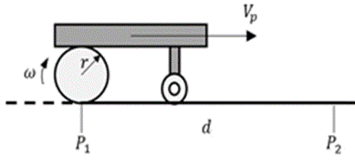

<h1>Aula 2</h1>

Esta clase consiste en repasar los conceptos del Movimiento Circular Uniformemente Acelerado (MCUA) a través de ejemplos matemáticos.

<h2>MRUA</h2>

El Movimiento Rectilíneo Uniformemente Acelerado (MRUA) es el movimiento de un objeto con una trayectoria recta, el cual irá de forma uniforme aumentando o disminuyendo la velocidad, es decir con aceleración lineal constante.

$$𝑎=𝑐𝑜𝑛𝑠𝑡𝑎𝑛𝑡𝑒 (\frac{𝑚}{𝑠^{2}})$$

$$𝑣_𝑓=𝑣_𝑜+𝑎𝑡 (\frac{𝑚}{洧맣)$$

$$𝑥_𝑓=𝑥_𝑜+𝑣_𝑜 𝑡+\frac{1}{2} 𝑎𝑡^{2} (𝑚)$$

Fuente: https://www.universoformulas.com/fisica/cinematica/movimiento-rectilineo-uniformemente-variado/

<h3>Ejercicio 1</h3>

Calcular:

a) La aceleración tangencial
b) La distancia recorrida

<h2>MCUA</h2>

El Movimiento Circular Uniformemente Acelerado (MCUA) es el movimiento de un objeto con una trayectoria circular, el cual irá de forma uniforme aumentando o disminuyendo la velocidad, es decir con aceleración angular constante.

$$𝑎_洧녫=\frac{𝑣_𝑡^{2}}{洧릏$$

$$𝑎_𝑡=𝛼\cdot𝑟$$

$$𝑣_𝑡=𝜔\cdot𝑟$$

$$$$

Fuente: https://slidetodoc.com/movimiento-circular-acelerado-la-velocidad-angular-el-movimiento/

<h3>Ejercicio 2</h3>

Un carro se desplaza circularmente en torno a un punto de 13m de radio, a 60 RPM y frena en 25 segundos. Calcular:

a) La velocidad tangencial
b) La aceleración tangencial 
c) El número de vueltas.

Fuente: https://slidetodoc.com/movimiento-circular-acelerado-la-velocidad-angular-el-movimiento/

<h3>Ejercicio 3</h3>

La plataforma de la imagen se desplaza del punto P1 a P2 en 4.8s, con una velocidad inicial en las ruedas traseras de 1.5m/s y una velocidad final en las mismas ruedas de 28rad/s. La rueda de la plataforma tiene un radio de 6cm. Determinar:

a) La velocidad angular en RPM
b) Si la plataforma acelera o desacelera
c) La distancia entre P1 a P2 (MCUA y MRUA)
d) El número de vueltas de la rueda

