<h1>Aula 22</h1>

Esta clase consiste en estudiar el sensor infrarrojo, el sensor de ultrasonido y el sensor de color.

<h2>Sensor infrarrojo, ultrasonido y sensor de color</h2>

Los sensores infrarrojos son dispositivos electrónicos de tecnología optoelectrónica (emisor infrarrojo y receptor), los cuales son ampliamente utilizados en la detección, clasificación, y posición de objetos, formas y/o colores.

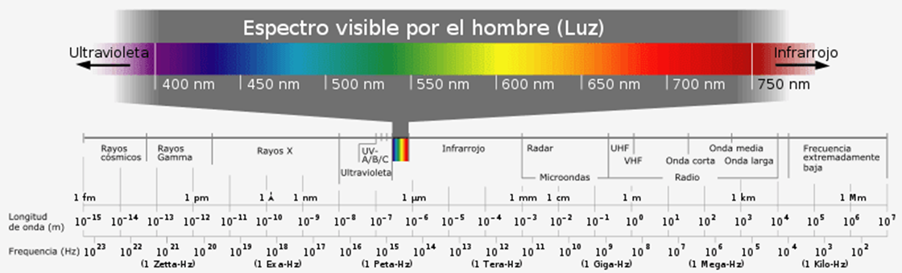

Fuente: http://www.circuitoselectronicos.org/2010/05/sensor-de-infrarrojos-emisor-y-receptor.html

<h3>Sensor de barrera</h3>

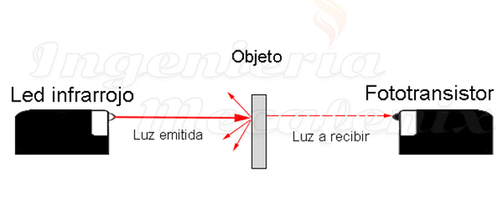

Fuente: https://www.ingmecafenix.com/automatizacion/sensor-optico/

<h3>Sensor reflectivo</h3>

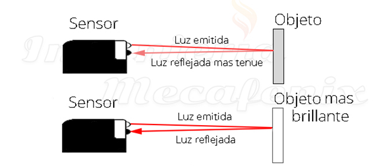

Fuente: https://www.ingmecafenix.com/automatizacion/sensor-optico/

<h3>Sensor de brillo</h3>

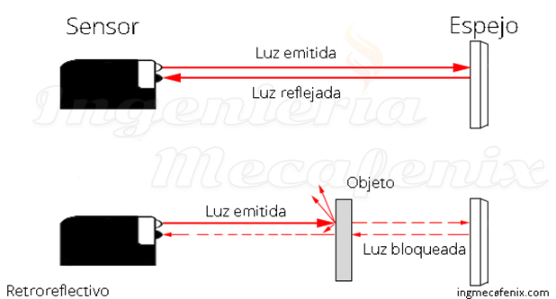

Fuente: https://www.ingmecafenix.com/automatizacion/sensor-optico/

<h3>Módulo de Arduino</h3>

El módulo infrarrojo detecta objetos en un rango máximo de 30 cm. Si el sensor detecta un objeto envía un cero lógico (LOW) y si no detecta envía un uno lógico (HIGH). 

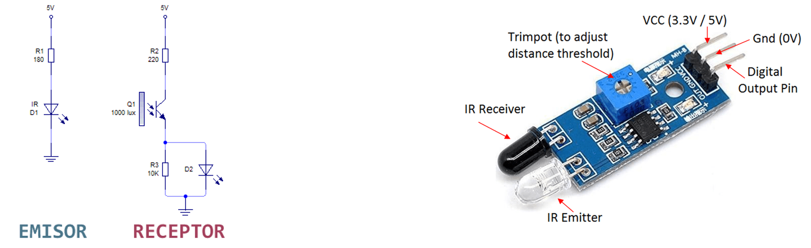

Fuentes: https://solarduino.com/infrared-ir-sensor-module-with-arduino/ y https://solarduino.com/infrared-ir-sensor-module-with-arduino/

<h2>Sensor de ultrasonido</h2>

Los sensores de ultrasonido detectan objeto a partir de la medición de distancia a través de ondas ultrasónicas (20kHz), teniendo en cuenta el tiempo desde que se emite la onda hasta que se recepciona.

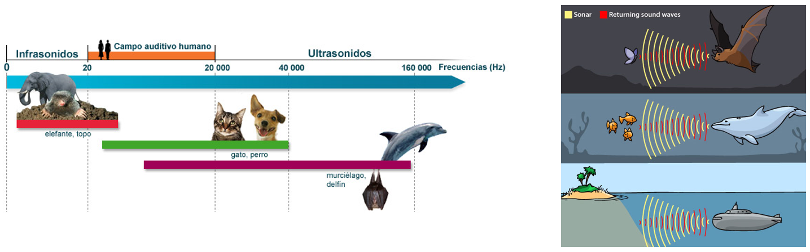

Fuentes: http://www.cochlea.org/es/sonidos/campo-auditivo-humano y https://www.bjultrasonic.com/es/uses-of-ultrasonic-waves/

<h3>Módulo de Arduino</h3>

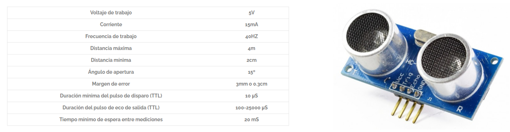

Fuentes: https://smelpro.com/blog/sensor-hc-sr04/ y https://naylampmechatronics.com/sensores-proximidad/10-sensor-ultrasonido-hc-sr04.html

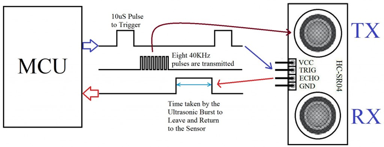

Fuente: https://www.puntoflotante.net/SENSOR-DISTANCIA-PROXIMIDAD-ULTRASONICO-HC-SR04.htm

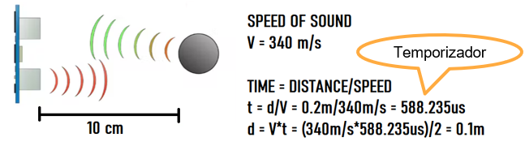

Fuente: https://create.arduino.cc/projecthub/abdularbi17/ultrasonic-sensor-hc-sr04-with-arduino-tutorial-327ff6

<h2>Sensor de color</h2>

El sensor de color basado en leds y LDR (resistencia variable con respecto a la intensidad lumínica) es un sistema de detección de color económico y eficaz, para esto, el sistema se debe aislar de la luz del ambiente (sol, bombillos, televisores, celulares, etc.). 

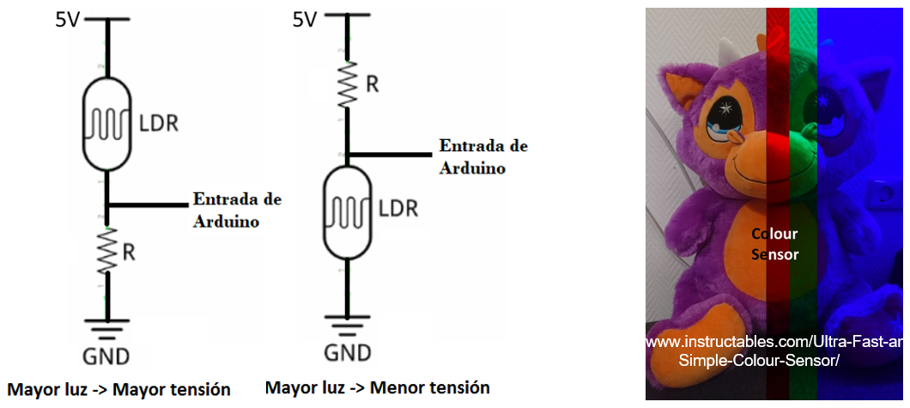

Una forma de detectar color de un objeto consiste en encender un led de cada color durante un tiempo determinado y posteriormente, realizar la lectura del voltaje (ADC).

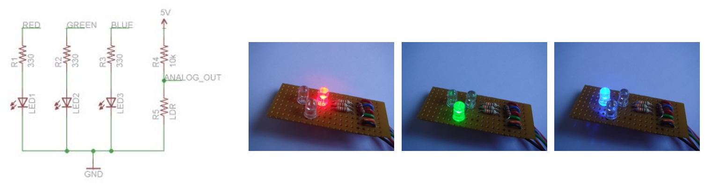

Fuente: https://iamzxlee.wordpress.com/2014/03/05/colour-sensor/

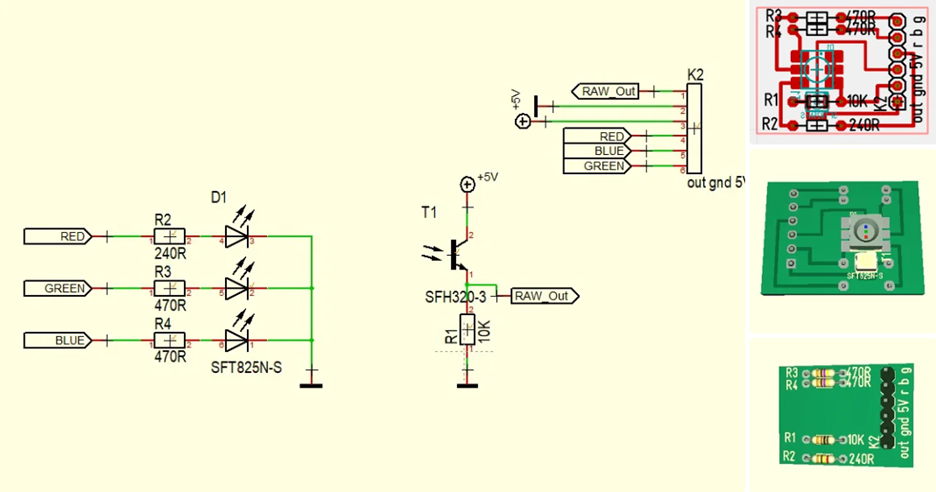

Fuente: https://www.instructables.com/Ultra-Fast-and-Simple-Colour-Sensor/

El método consiste en:
1. Encender el led rojo durante un 1s.
2. Comparar el voltaje del ADC con el rango del voltaje caracterizado para el color rojo.
3. Apagar el led rojo durante un 1s.
4. Encender el led verde durante un 1s.
5. Comparar el voltaje del ADC con el rango del voltaje caracterizado para el color verde.
6. Apagar el led verde durante un 1s.

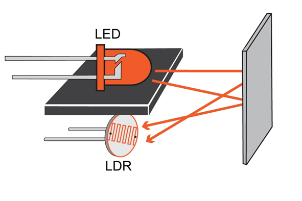

Fuente: https://www.allaboutcircuits.com/projects/how-to-sense-color-with-an-arduino/

Otra forma de detectar el color de un objeto es irradiar el objeto con luces RGB al mismo tiempo e identificar la luz reflejada, a través de la lectura del voltaje (ADC).

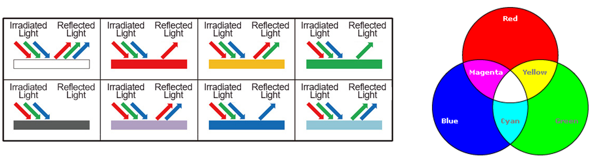

Fuentes: https://www.rohm.com/electronics-basics/sensor/color-sensor y https://iamzxlee.wordpress.com/2014/03/05/colour-sensor/