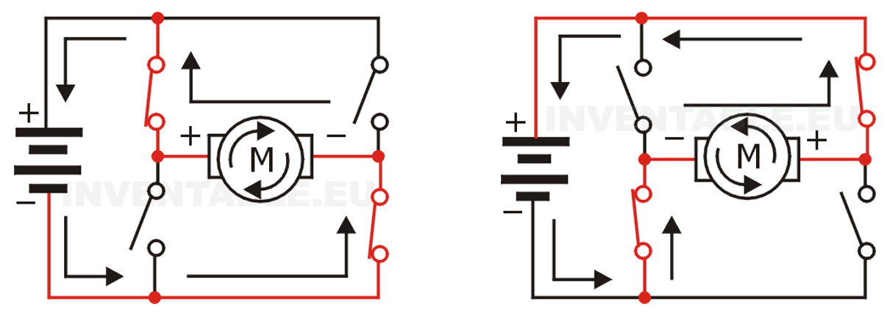

<h1>Aula 3</h1>

Esta clase se basa en entender el funcionamiento del driver de potencia para variar la velocidad y el giro de un motor DC.

<h2>Puente H</h2>

El puente H para motores DC es un arreglo de cuatro transistores NPN, PNP y/o MOSFET que tienen como objetivo, conmutar el sentido de la corriente sobre el motor DC. Algunos drivers de potencia comerciales y de bajo costo son el L293 y L298.

Fuente: https://www.inventable.eu/2017/05/26/funciona-puente-motores-corriente-continua/

Fuente: https://www.inventable.eu/2017/05/26/funciona-puente-motores-corriente-continua/

Fuente: https://www.inventable.eu/2017/05/26/funciona-puente-motores-corriente-continua/

<h2>PWM</h2>

PWM es una modulación por ancho de pulso de una señal cuadrada, donde se define un tiempo en alto (Duty Cycle) y un tiempo en bajo. Es utilizado para variar la velocidad de motores DC, la intensidad de leds, etc.

