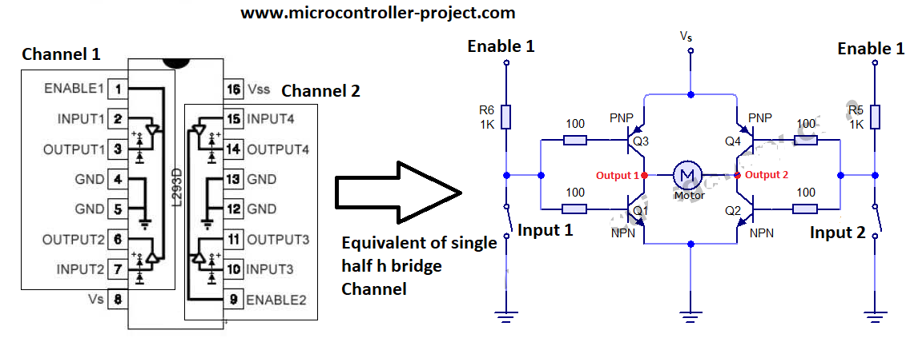
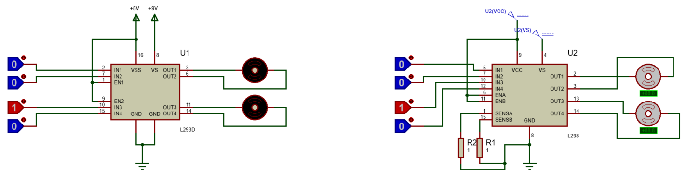

<h1>Aula 3</h1>

Esta clase consiste en entender el funcionamiento del driver de potencia para variar la velocidad y el giro de un motor DC.

<h2>Puente H</h2>

El puente H para motores DC es un arreglo de cuatro transistores NPN, PNP y/o MOSFET que tienen como objetivo, conmutar el sentido de la corriente sobre el motor DC. Algunos drivers de potencia comerciales y de bajo costo son el L293 y L298, los cuales están conformados por transistores NPN que trabajan en dos estados: a) corte (interruptor abierto) o b) saturación (interruptor cerrado). Los transistores NPN cuando tienen un voltaje positivo en la base funcionan como interruptor cerrado y cuando tienen un voltaje de 0V en la base funcionan como interruptor abierto. En el caso de los transistores PNP el funcionamiento con respecto a los voltajes es inverso a los transistores NPN.

Fuente: https://www.inventable.eu/2017/05/26/funciona-puente-motores-corriente-continua/

Fuente: https://www.inventable.eu/2017/05/26/funciona-puente-motores-corriente-continua/

Fuente: https://lastminuteengineers.com/l293d-dc-motor-arduino-tutorial/

<h3>PWM</h3>

PWM es una modulación por ancho de pulso de una señal cuadrada, donde se define un tiempo en alto (Duty Cycle) y un tiempo en bajo. Es utilizado para variar la velocidad de motores DC, la intensidad de leds, etc.

Fuente: https://lastminuteengineers.com/l293d-dc-motor-arduino-tutorial/

<h3>L298</h3>

El puente H L298 está conformado por transistores NPN y el cual tiene un salida de 2A por cada canal. 

Fuente: https://www.prometec.net/l298n/

Fuente: https://www.luisllamas.es/arduino-motor-corriente-continua-l298n/

Teniendo en cuenta valores de resistencias de precisión (RSA y RSB) muy bajos (ej: 0.05 Ohm) y midiendo los voltajes en los puntos SENS A y SENS B con respecto a tierra, se puede calular la corriente que consume cada motor a través de la Ley de Ohm (I=V/R).

Fuente: https://www.inventable.eu/2017/05/26/funciona-puente-motores-corriente-continua/

Fuente: https://www.prometec.net/l298n/

<h3>L293</h3>

El puente H L293 está conformado por transistores NPN y PNP, el cual tiene un salida de 0.6A por cada canal. 

Fuente: https://www.instructables.com/How-to-use-the-L293D-Motor-Driver-Arduino-Tutorial/

Fuente: https://www.engineersgarage.com/l293d-pin-description-and-working/

Para entender mejor el comportamiento de un circuito Pull Up o Pull Down, presione en <a href="http://tinyurl.com/25mjhlj9">la simulación</a>

Fuente: https://masterplc.com/simulador/

Fuente: https://www.tinkercad.com/things/ly13iGzS0FL-2-dc-motors-with-l293d-and-arduino

<h3>Ejercicio 1</h3>

Simular en Proteus con los puente H L298 y L293, el giro de dos motores DC a través de pulsos y con velocidad constante

