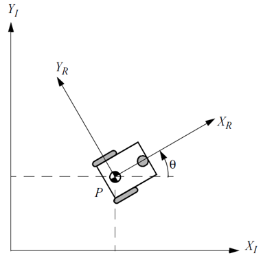

<h1>Aula 4</h1>

Esta clase consiste en comprender la cinemática directa e inversa de la plataforma diferencial.

<h2>Plataforma diferencial</h2>

Son robots móviles que se componen por un sistema basado en dos ruedas motrices en paralelo, las cuales pueden girar a distinta velocidad.

Fuente: Introduction to Autonomous Mobile Robots. Roland Siegwart and Illah R. Nourbakhsh. 2004

$$𝑉_𝑃=\frac{𝑉_𝐷+𝑉_𝐼}{2}$$

$$𝜔_𝑃=\frac{𝑉_𝐷−𝑉_𝐼}{𝐿}$$

Aplicando la relación de velocidades $𝑣=𝜔\cdot 𝑟$

$$𝑉_𝑃=\frac{𝑟_𝑟(𝜔_𝐷+𝜔_𝐼)}{2}$$

$$𝜔_𝑃=\frac{𝑟_𝑟(𝜔_𝐷−𝜔_𝐼)}{𝐿}$$

<h3>Ejercicio 1</h3>

Teniendo en cuenta que un robot móvil diferencial, gira en la rueda derecha a 75 𝑅𝑃𝑀 y en la rueda izquierda a 40 𝑅𝑃𝑀. Así mismo, el ancho de la plataforma y el radio de las ruedas es de 12 𝑐𝑚 y 3.5 𝑐𝑚, respectivamente. Determinar:

<ol type="a">
    <li>La velocidad lineal de la plataforma</li>
    <li>La velocidad angular de la plataforma</li>
    <li>El sentido de giro de la plataforma</li>
</ol>

<h3>Ejercicio 2</h3>

Un robot móvil diferencial, gira en la rueda derecha a 0.35 𝑚/𝑠 y en la rueda izquierda a 0.27 𝑚/𝑠, siendo que el radio de las ruedas es de 5 𝑐𝑚 y el ancho de la plataforma es de 9 𝑐𝑚. Si la plataforma acelera angularmente a −0.1 rad/ $𝑠^2$ en 5𝑠, determinar:

<ol type="a">
    <li>Las velocidades de las ruedas en RPM</li>
    <li>La velocidad lineal inicial y la velocidad angular inicial de la plataforma</li>
    <li>El radio sobre el cual gira la plataforma</li>
    <li>La aceleración lineal de la plataforma</li>
    <li>La velocidad lineal final y la velocidad angular final de la plataforma</li>
    <li>La velocidad final de la rueda derecha e izquierda</li>
    <li>El sentido de giro de la plataforma</li>
    <li>El número de vueltas de cada una de las ruedas</li>
    <li>La distancia recorrida de cada una de las ruedas</li>
</ol>