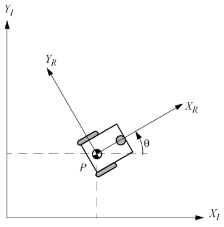

<h1>Aula 5</h1>

Esta clase consiste en aplicar la cinemática directa e inversa de la plataforma diferencial analizando recorridos por transiciones.

<h2>Análisis de recorrido por transiciones</h2>

El análisis de recorrido consiste en analizar cada trayectoria (lineal o angular) de la plataforma robótica, para determinar la posición y la rotación de la misma.

Fuente: Introduction to Autonomous Mobile Robots. Roland Siegwart and Illah R. Nourbakhsh. 2004

$𝑉_𝑃≠0$ y $𝜔_𝑃=0$ 

$𝑉_𝑃=0$ y $𝜔_𝑃≠0$

$𝑉_𝑃=\frac{𝑟_𝑟(𝜔_𝐷+𝜔_𝐼)}{2}$ y $𝜔_𝑃=\frac{𝑟_𝑟(𝜔_𝐷−𝜔_𝐼)}{𝐿}$

$𝜔_𝐼=−\frac{𝐿𝜔_𝑃}{2𝑟_𝑟}+\frac{𝑉_𝑃}{𝑟_𝑟}$ y $𝜔_𝐷=\frac{𝐿𝜔_𝑃}{2𝑟_𝑟}+\frac{𝑉_𝑃}{𝑟_𝑟}$

<h3>Ejercicio 1</h3>

Recorrido 1: Un robot móvil diferencial de ancho de 15 𝑐𝑚 se desplaza a 40° con respecto al eje X durante 7.4𝑠 y gira en las ruedas (𝑟=3.5𝑐𝑚) derecha e izquierda a 28 𝑅𝑃𝑀. Así mismo, las posiciones iniciales de la plataforma en X y Y son de 4 𝑚 y 3 𝑚, respectivamente. Sin aceleración lineal y angular, determinar:

<ol type="a">
    <li>La posición final en X</li>
    <li>La posición final en Y</li>
    <li>El ángulo final de la plataforma</li>
</ol>

<h3>Ejercicio 2</h3>

Recorrido 2: A partir de la trayectoria 1 (ejercicio 1) un robot móvil diferencial gira en las ruedas derecha e izquierda a 20 𝑅𝑃𝑀 y −20 𝑅𝑃𝑀, respectivamente; durante 0.5𝑠. Sin aceleración lineal y angular, determinar:

<ol type="a">
    <li>La posición final en X</li>
    <li>La posición final en Y</li>
    <li>El ángulo final de la plataforma</li>
</ol>

<h3>Ejercicio 3</h3>

Recorrido 3: A partir de la trayectoria 2 (ejercicio 2) un robot móvil diferencial gira en las ruedas derecha e izquierda a −10 𝑅𝑃𝑀; durante 1.5𝑠. Sin aceleración lineal y angular, determinar:

<ol type="a">
    <li>La posición final en X</li>
    <li>La posición final en Y</li>
    <li>El ángulo final de la plataforma</li>
</ol>

<h3>Ejercicio 4</h3>

Recorrido 4: A partir de la trayectoria 3 (ejercicio 3) un robot móvil diferencial gira en las ruedas derecha e izquierda a −5 𝑅𝑃𝑀 y 5 𝑅𝑃𝑀, respectivamente; durante 3𝑠. Sin aceleración lineal y angular, determinar:

<ol type="a">
    <li>La posición final en X</li>
    <li>La posición final en Y</li>
    <li>El ángulo final de la plataforma</li>
</ol>